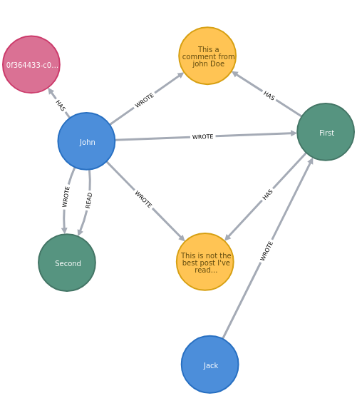
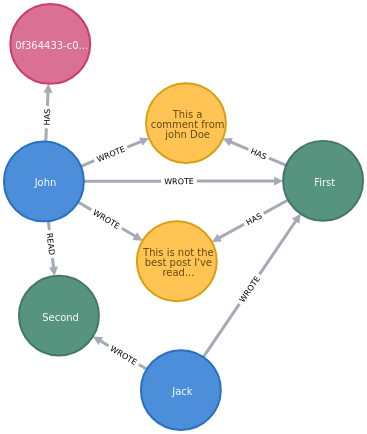
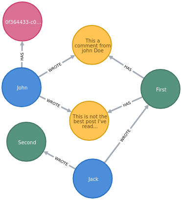

# Updating and deleting

## Updating / Deleting nodes
Nothing special here, we just do what we're used to do with ecto

## Updating relationship data
Updating relationship data is quite easy: we just need to update the _rel\_[relationship\_type]_ field in the end node and that's it!

### Example
In cypher:
```cypher
MATCH
    (u:User)-[rel:WROTE]->(p:Post)
WHERE
    u.firstName = "John"
    AND p.title = "First"
SET
    rel.when = ~D[2020-01-09],
    rel.from = "My Fairphone"
```

In EctoNeo4j:
```elixir
rel_data = %{
    when: ~D[2020-01-09],
    from: "My Fairphone"
}

Repo.get_by!(Post, title: "First")
|> Neo4j.preload(:wrote_post)
|> Ecto.Changeset.change(%{rel_wrote: rel_data})
|> Neo4j.update(Repo)

# Result
{:ok,
 %GraphApp.Blog.Post{
   __meta__: #Ecto.Schema.Metadata<:loaded, "Post">,
   has_comment: #Ecto.Association.NotLoaded<association :has_comment is not loaded>,
   read_post: #Ecto.Association.NotLoaded<association :read_post is not loaded>,
   read_post_uuid: nil,
   rel_read: nil,
   rel_wrote: %{"from" => "My Fairphone", "when" => ~D[2020-01-09]},
   text: "This is the first",
   title: "First",
   uuid: "ae830851-9e93-46d5-bbf7-23ab99846497",
   wrote_post: %GraphApp.Account.User{
     __meta__: #Ecto.Schema.Metadata<:built, "User">,
     firstName: "John",
     has_userprofile: #Ecto.Association.NotLoaded<association :has_userprofile is not loaded>,
     lastName: "Doe",
     read_post: #Ecto.Association.NotLoaded<association :read_post is not loaded>,
     uuid: "12903da6-5d46-417b-9cab-bd82766c868b",
     wrote_comment: #Ecto.Association.NotLoaded<association :wrote_comment is not loaded>,
     wrote_post: #Ecto.Association.NotLoaded<association :wrote_post is not loaded>
   },
   wrote_post_uuid: "12903da6-5d46-417b-9cab-bd82766c868b"
 }}
```

## Updating relationship
We simply follow the two following rules:
- Work with [put_assoc](https://hexdocs.pm/ecto/Ecto.Changeset.html#put_assoc/4) and work on the associaiton as a whole
- Use `Ecto.Adapters.Neo4j.update` instead of the classic `Repo.update` 

### Examples
So, our graph is like this:  


Let's rework it!  

```elixir
alias Ecto.Adapters.Neo4j

alias GraphApp.Repo
alias GraphApp.Account.{User, UserProfile}
alias GraphApp.Blog.{Post, Comment}
```

Let's start by adding a new user

```elixir
new_user_data = %User{
    uuid: "ec1741ba-28f2-47fc-8a96-a3c5e24c42da",
    firstName: "Jack",
    lastName: "Sparrow"
}
new_user = Neo4j.insert!(Repo, new_user_data)

# Result
%GraphApp.Account.User{
  __meta__: #Ecto.Schema.Metadata<:loaded, "User">,
  firstName: "Jack",
  has_userprofile: #Ecto.Association.NotLoaded<association :has_userprofile is not loaded>,
  lastName: "Sparrow",
  read_post: #Ecto.Association.NotLoaded<association :read_post is not loaded>,
  uuid: "ec1741ba-28f2-47fc-8a96-a3c5e24c42da",
  wrote_comment: #Ecto.Association.NotLoaded<association :wrote_comment is not loaded>,
  wrote_post: #Ecto.Association.NotLoaded<association :wrote_post is not loaded>
}
```

#### Add a relationship between User "Jack" and Post "First" (from parent)
In cypher:
```cypher
MATCH
    (u:User),
    (p:Post)
WHERE
    u.firstName = "Jack"
    AND p.title = "First"
MERGE
    (u)-[:WROTE]->(p)
```

```elixir
post = Repo.get_by!(Post, title: "First")

user = Repo.get_by!(User, firstName: "Jack")
|> Neo4j.preload(:wrote_post)
|> Ecto.Changeset.change()
|> Ecto.Changeset.put_assoc(:wrote_post, [post])
|> Neo4j.update

# Result
{:ok,
 %GraphApp.Account.User{
   __meta__: #Ecto.Schema.Metadata<:loaded, "User">,
   firstName: "Jack",
   has_userprofile: #Ecto.Association.NotLoaded<association :has_userprofile is not loaded>,
   lastName: "Sparrow",
   read_post: #Ecto.Association.NotLoaded<association :read_post is not loaded>,
   uuid: "ec1741ba-28f2-47fc-8a96-a3c5e24c42da",
   wrote_comment: #Ecto.Association.NotLoaded<association :wrote_comment is not loaded>,
   wrote_post: [
     %GraphApp.Blog.Post{
       __meta__: #Ecto.Schema.Metadata<:loaded, "Post">,
       has_comment: #Ecto.Association.NotLoaded<association :has_comment is not loaded>,
       read_post: #Ecto.Association.NotLoaded<association :read_post is not loaded>,
       read_post_uuid: nil,
       rel_read: nil,
       rel_wrote: nil,
       text: "This is the first",
       title: "First",
       uuid: "ae830851-9e93-46d5-bbf7-23ab99846497",
       wrote_post: #Ecto.Association.NotLoaded<association :wrote_post is not loaded>,
       wrote_post_uuid: "ec1741ba-28f2-47fc-8a96-a3c5e24c42da"
     }
   ]
 }}
```
Here is our new graph state:  


#### Add a relationship between User "Jack" and Post "Second" (from child) with new relationship data
In Cypher:
```cypher
MATCH
    (u:User),
    (p:Post)
WHERE
    u.firstName = "Jack"
    AND p.title = "First"
MERGE
    (u)-[rel:WROTE]->(p)
```

In EctoNeo4j:
```elixir
rel_data = %{when: ~D[2020-01-09], from: "My Fairphone"}

Repo.get_by!(Post, title: "Second")
|> Neo4j.preload([:wrote_post])
|> Ecto.Changeset.change()
|> Ecto.Changeset.put_assoc(:wrote_post, new_user)
|> Neo4j.update(Repo)

# Result
{:ok,
 %GraphApp.Blog.Post{
   __meta__: #Ecto.Schema.Metadata<:loaded, "Post">,
   has_comment: #Ecto.Association.NotLoaded<association :has_comment is not loaded>,
   read_post: #Ecto.Association.NotLoaded<association :read_post is not loaded>,
   read_post_uuid: nil,
   rel_read: nil,
   rel_wrote: %{"from" => "My Fairphone", "when" => ~D[2020-01-09]},
   text: "This is the second",
   title: "Second",
   uuid: "727289bc-ec28-4459-a9dc-a51ee6bfd6ab",
   wrote_post: %GraphApp.Account.User{
     __meta__: #Ecto.Schema.Metadata<:loaded, "User">,
     firstName: "Jack",
     has_userprofile: #Ecto.Association.NotLoaded<association :has_userprofile is not loaded>,
     lastName: "Sparrow",
     read_post: #Ecto.Association.NotLoaded<association :read_post is not loaded>,
     uuid: "ec1741ba-28f2-47fc-8a96-a3c5e24c42da",
     wrote_comment: #Ecto.Association.NotLoaded<association :wrote_comment is not loaded>,
     wrote_post: #Ecto.Association.NotLoaded<association :wrote_post is not loaded>
   },
   wrote_post_uuid: "ec1741ba-28f2-47fc-8a96-a3c5e24c42da"
 }}
```

Here is how the graph looks like now:  


We can see that an intersting thing happened: the relationship with the user "John" has been automatically removed.  

But we can do it ourselves.

#### Remove all relationhips between user "Jon" and posts
In cypher:
```cypher
MATCH
    (u:User),
    (u)-[rel_wrote:WROTE]->(:Post),
    (u)-[rel_read:WROTE]->(:Post)
WHERE
    u.firstName = "John"
DELETE
    rel_wrote, rel_read
```

In EctoNeo4j:
```elixir
Repo.get_by!(User, firstName: "John")
|> Neo4j.preload([:wrote_post,:read_post])
|> Ecto.Changeset.change()
|> Ecto.Changeset.put_assoc(:wrote_post, [])
|> Ecto.Changeset.put_assoc(:read_post, [])
|> Neo4j.update(Repo)

#Result
{:ok,
 %GraphApp.Account.User{
   __meta__: #Ecto.Schema.Metadata<:loaded, "User">,
   firstName: "John",
   has_userprofile: #Ecto.Association.NotLoaded<association :has_userprofile is not loaded>,
   lastName: "Doe",
   read_post: [],
   uuid: "12903da6-5d46-417b-9cab-bd82766c868b",
   wrote_comment: #Ecto.Association.NotLoaded<association :wrote_comment is not loaded>,
   wrote_post: []
 }}
```

Here is how the graph looks like now:  


## Batch queries
Some updates or deletes can touch a large number of node and therefore required to be executed as batch in order to perform well (and to finish...).   
EctoNeo4j provides utility functions for this purpose: `Ecto.Adapters.Neo4j.batch_query(cql, params, batch_type, opts)` and `Ecto.Adapters.Neo4j.batch_query!(cql, params, batch_type, opts)`.  
There is two types of batches and each require a specially formed query.  
They works on the same logic: 
  - 1. execute a query 
  - 2. count the touched nodes
  - if the number of touched nodes is not 0 then back to 1  

### Batch types
#### :basic
The default batch type is `:basic`. Query must have:  
  - `LIMIT {limit}` in order to specify the chunk size
  - returns `RETURN COUNT(the_node_you_re_touching) AS nb_touched_nodes` in order to have the count of touched nodes.  
This batch type is usually used for `delete` operation.  
It is not required to provide the `limit` in your `params`, it will be handled by `batch_query`.   

Example:
```
cql = """
MATCH
  (n:Post)
WHERE
  n.title CONTAINS "this"
WITH                            <--- The `WITH` allows to work on a subset...
  n AS n                        <--- 
LIMIT {limit}                   <--- with the specified nuber of node
DETACH DELETE                   <--- Perform the desired operation
  n
RETURN
  COUNT(n) AS nb_touched_nodes  <--- And return the number of nodes touched by the operation
"""
Ecto.Adapters.Neo4j.batch_query(cql)
```

#### :with_skip
This batch type is useful where a simple `COUNT` is irrevelant (in update operation for example). Query must have:  
  - `SKIP {skip} LIMIT {limit}` in order to specify the chunk size
  - returns `RETURN COUNT(the_node_you_re_touching) AS nb_touched_nodes` in order to have the count of touched nodes.  
It is not required to provide the `skip` nor the `limit` in your `params`, they will be handled by `batch_query`.   

Example:
```
cql = """
MATCH
  (n:Post)
WHERE
  n.title CONTAINS "this"
WITH                                <--- THe WITH allows to work on a subset...
  n AS n                            <--- 
SKIP {skip} LIMIT {limit}           <--- with the specified nuber of node
SET                                 <--- Perform the desired operation
  n.title = "Updated: " + n.title 
RETURN
  COUNT(n) AS nb_touched_nodes      <--- And return the number of nodes touched by the operation
"""
Ecto.Adapters.Neo4j.batch_query(cql, %{}, :with_skip)
```

### Chunk size
The default chunk size is 10_000.  
The ideal chunk size is tighly related to the machine RAM, and you can specify if you want:
  - at query level with the options `[chunk_size: integer]`  
  Example: `Ecto.Adapters.Neo4j.query(cql, params, :basic, [chunk_size: 50_000])`
  - in your configuration, you can define the desired default chunk_size:  
```elixir
  config :ecto_neo4j, Ecto.Adapters.Neo4j,
  chunk_size: 50_000
```

### update_all, delete_all
You can have `Repo.update_all` and `Repo.delete_all` executed as batches with the option `[batch: true]` (without any query tricks).  
This option can be added in your configuration if you want the behaviour to happen for all `update_all`s and `delete_all`s.
```elixir
  config :ecto_neo4j, Ecto.Adapters.Neo4j,
  batch: true
```